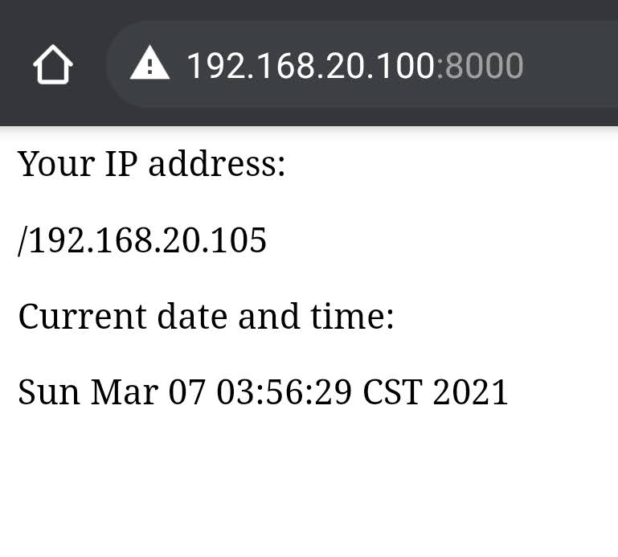

## CIS 3329 Network Architectures Lab04 Create a Dynamic Web Server
**Objective:**

Write a program which listens on a TCP port specified at run time. When a connection is made, the server sends back an HTTP 200 response and HTML text, which when shown in a browser, will display:

> Your IP address is: "IP Address"
> 
> Current date and time:WWW MMM dd hr:mi:se yyyy
> 
**Implementation:**
- Language: Java
- Imported Libraries: Date , ServerSocket, Socket, PrintWriter
- Compiler: IntelliJ

**Screenshot:**

**Devices:**
- Host: Asus Zenbook Duo (Windows 10 1909)
- Client: Google Pixel 4 (Android 11)
> Written with [StackEdit](https://stackedit.io/).

